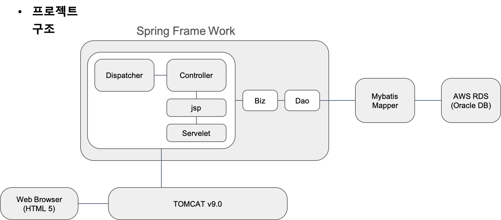
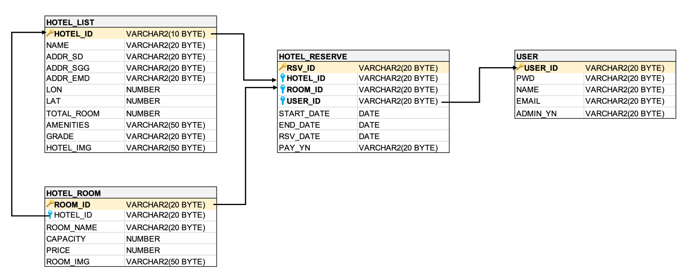

[링크](http://multicampus5-7.xyz:8080/main.mc)

# YeogiNolja

## 프로젝트 배경

### 프로젝트 주제

- 숙박 예약 시스템

### 프로젝트 목적

- DB, Spring Framework를 활용한 MVC모델 구현
- 날짜, 위치 요소를 응용할 수 있는 시스템 기획

### 개요

#### 개발환경

| 언어      | Java, JavaScript, JSP, HTML5, CSS3.0, SQL |
| --------- | ----------------------------------------- |
| DB        | AWS RDS                                   |
| Framework | Maven, Spring, Mybatis, Bootstrap         |
| IDE       | Eclipse, SQL Developer                    |
| 기타      | kakao map api                             |

### 구조

### ERD

